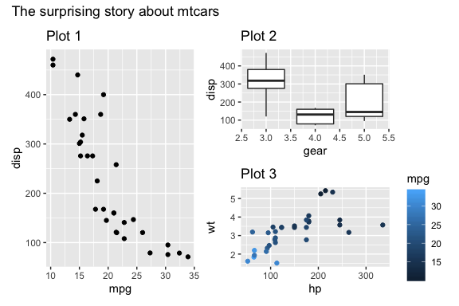

# R things that are hot right now

`to do` `r` `things to keep in mind`

**To sort:**

Cool r commands :

use count\(\) using the sort and wt entries.

add\_count\(\) instead of group\_by/mutate/ungroup

summarize\(x = list\(\)\)

mutate\(thingie = fct\_reorder\(column, function\)

geom\_col\+coord\_flip \(to deal w/ pesky labels

flow::flow\_view\(\) on a function, a quoted expression, or the path of an R script to visualize it.

flow::flow\_run\(\)  on a call to a function to visualize which logical path in the code was taken. Set browse = TRUE to debug your function block by block \(similar to base::browser\(\)\) as the diagram updates.

janitor::clean\_names to clean df column names when imported by a silly method.

dplyr::slice\_max to get the top **n** entries of a df \(according to a certain field\)

asdf

combine \`crossing\` with \`augment\` especially augment\(data\_that\_has\_been\_crossed, type.predict = "response"\)

To do Net Promoter Score or other marketting stuff: [https://cran.r\-project.org/web/packages/marketr/vignettes/introduction\_to\_marketer.html](https://cran.r-project.org/web/packages/marketr/vignettes/introduction_to_marketer.html)

To send better bash scripts \(to talk to the console\):  [https://www.rdocumentation.org/packages/base/versions/3.6.2/topics/shQuote](https://www.rdocumentation.org/packages/base/versions/3.6.2/topics/shQuote)

mtcars %\>% select\(1,2,3\) %\>%

    purrr::by\_row\(sum, .collate = "cols", .to = "BOOM"\)

Cool correlation Chart: PerformanceAnalytics::chart.Correlation\(iris\[\-5\],pch=21\)

[https://prodi.gy/](https://prodi.gy/buy) \- a tool that helps create labels for data, and learns while it's going.

**How it all started:**

[How I used R to create a word cloud, step by step | Georeferenced](http://georeferenced.wordpress.com/2013/01/15/rwordcloud/%20%5Cl%20comment-3992)

**Concept / meta**

**Startup**

Complicated startup sequence: [https://rstats.wtf/images/R\-startup.svg](https://rstats.wtf/images/R-startup.svg)

**Efficiency**

**[https://www.fstpackage.org/](https://www.fstpackage.org/)**

**Tips**

[4 ways to be more productive, using RStudio's terminal \- Jozef's Rblog](https://jozefhajnala.gitlab.io/r/r905-rstudio-terminal/)

[https://speakerdeck.com/jennybc/how\-to\-name\-files](https://speakerdeck.com/jennybc/how-to-name-files) \- How to name fil.....

**Teaching**

[swcarpentry/r\-novice\-gapminder: Introduction to R for non\-programmers using gapminder data.](https://github.com/swcarpentry/r-novice-gapminder)

[RStudio Cloud](https://rstudio.cloud/learn/primers)

[https://education.rstudio.com/learn/](https://education.rstudio.com/learn/)

[master\-the\-tidyverse/01\-Visualize\-Data.Rmd at master · rstudio/master\-the\-tidyverse](https://github.com/rstudio/master-the-tidyverse)

[Teaching Tech Together](http://teachtogether.tech/)

[Learning to Teach Machines to Learn | Alison Hill](https://alison.rbind.io/post/2019-12-23-learning-to-teach-machines-to-learn/)

To create exams: [http://www.r\-exams.org/tutorials/](http://www.r-exams.org/tutorials/)

To create dummy data/fake PII data for examples: [https://github.com/paulhendricks/generator](https://github.com/paulhendricks/generator) or [https://github.com/trinker/wakefield](https://github.com/trinker/wakefield)

**Blogs**

[R in Business Intelligence – Jan Gorecki – blog](http://jangorecki.github.io/blog/2015-01-19/R-in-BI.html)

[\#\# EDA \#\# Explore Your Dataset in R — Little Miss Data](https://www.littlemissdata.com/blog/simple-eda)

**Principles**

[t\-test and how big sample group \- Alexa and Accented English](https://juliasilge.com/blog/amazon-alexa/)

[omg, binder\! \- the stupidest thing...](https://kbroman.org/blog/2019/02/18/omg_binder/)

**Debugging**

[Debugging in R: How to Easily and Efficiently Conquer Errors in Your Code](https://www.inwt-statistics.com/read-blog/debugging-in-r.html)

to view errors smarter: recover\(\) \( [https://www.inwt\-statistics.com/read\-blog/debugging\-in\-r.html](https://www.inwt-statistics.com/read-blog/debugging-in-r.html)\)

[proffer](https://cran.r-project.org/package=proffer) v0.0.2: Builds on [pprof](https://github.com/google/pprof) to provide profiling tools capable of detecting sources of slowness in R code. Look [here](https://r-prof.github.io/proffer/) for more information.

**Convenience:**

[http://dirk.eddelbuettel.com/code/anytime.html](http://dirk.eddelbuettel.com/code/anytime.html) automatically detect date format from ANY string

[funneljoin](https://cran.r-project.org/package=funneljoin) v0.1.0: Implements a time\-based joins to analyze sequence of events, both in memory and out of memory. See the [vignette](https://cran.r-project.org/web/packages/funneljoin/vignettes/funneljoin.html) for details.

[biglmm](https://cran.r-project.org/package=biglmm) v0.9\-1: Provides regression for data too large to fit in memory. This package functions exactly like the [biglm](https://cran.r-project.org/package=biglm) package, but works with later versions of R.

[dbx](https://cran.r-project.org/package=dbx) v0.2.1: Provides select, insert, update, upsert, and delete database operations for PostgreSQL, MySQL, SQLite, and other databases. See the [README](https://cran.r-project.org/web/packages/dbx/readme/README.html) for usage

[metaDigitise](https://cran.r-project.org/package=metaDigitise) v1.0.0: Provides functions to extract, summarize and digitize data from published figures in research papers. The [vignette](https://cran.r-project.org/web/packages/metaDigitise/vignettes/metaDigitise.html) shows how to use the package.  Printed Plot

**[visdat](https://cran.r-project.org/web/packages/visdat/)** **\- vis\_guess\(\) guesses the type of each field**

[naniar](https://cran.r-project.org/web/packages/naniar/vignettes/naniar-visualisation.html)::**vis\_miss** \- to visualize missing fields

**Automation/pipeline**

[targets](https://github.com/ropensci/targets) \(ex Drake\) \- Let's you set up a pipeline of steps, including a .sh file and network analysis\!

[callr](https://callr.r-lib.org/) \- for controller scripts that source in many things, this keeps each call in its own environment

[docker](https://zoom.us/rec/play/UAl03RY7inkkgGMa0cswCQEMNdL1JAkPKbf5lDhXSB4u0ZVEb9NB7df1ly8ASXJasm82Qo7hZkTkLtoa.yNbuOpOatw-xxcdY?continueMode=true&_x_zm_rtaid=HzARX07gSWutvLkE_TZLoQ.1654249149557.4acf2630650b406669b0f39f2d3910b4&_x_zm_rhtaid=959) \- Talk about deploying Docker & Kubernettes

**Obtaining, Cleaning & Processing**

**DataOps**

[Scheduling R Tasks via Windows Task Scheduler | TRinker's R Blog](https://trinkerrstuff.wordpress.com/2015/02/11/scheduling-r-tasks-via-windows-task-scheduler/)

[CRAN \- Package genderizeR](https://cran.r-project.org/web/packages/genderizeR/index.html)

[Twitter analysis using R \(Semantic analysis of French elections\)](http://enhancedatascience.com/2017/07/17/twitter-analysis-using-r/)

[Google Vision API in R with RoogleVision | Stoltzmaniac](https://www.stoltzmaniac.com/google-vision-api-in-r-rooglevision/)

[How to make your machine learning model available as an API with the plumber package](https://shirinsplayground.netlify.com/2018/01/plumber/)

[NCmisc\-package: Miscellaneous Functions for Creating Adaptive Functions and... in NCmisc: Miscellaneous Functions for Creating Adaptive Functions and Scripts](https://rdrr.io/cran/NCmisc/man/NCmisc-package.html)

[Securing a dockerized plumber API with SSL and Basic Authentication | QUNIS](https://qunis.de/how-to-make-a-dockerized-plumber-api-secure-with-ssl-and-basic-authentication/)

[About — Deon](http://deon.drivendata.org/)

**Scraping**

[CRAN \- Package robotstxt](https://cran.rstudio.com/web/packages/robotstxt/)

[Pirating Web Content Responsibly With R | rud.is](https://rud.is/b/2017/09/19/pirating-web-content-responsibly-with-r/)

ORiley book on Mining social networks [TOC](https://learning.oreilly.com/library/view/mining-the-social/9781491973547/) \- [github](https://github.com/mikhailklassen/Mining-the-Social-Web-3rd-Edition)

**Analysis**

**General**

[MultiFit](https://cran.r-project.org/package=MultiFit) v0.1.2: Provides functions to test for independence of two random vectors and learn and report the dependency structure. For more information, see [Gorsky and Ma \(2018\)](arxiv:1806.06777) and the [vignette](https://cran.r-project.org/web/packages/MultiFit/vignettes/multiFit.html). Like correlation?

Compare data.frames: compareDF::compare\_df\(\) and then to visualize, compareDF::create\_output\_table

To categorize numeric variable:

In ggplot2:

- cut\_number\(\): Makes n groups with \(approximately\) equal numbers of observation
- cut\_interval\(\): Makes n groups with equal range
- cut\_width: Makes groups of width width

Recommendation systems: 

- [https://blog.datasciencedojo.com/movie\-recommender\-systems/](https://blog.datasciencedojo.com/movie-recommender-systems/)
- [https://cran.r\-project.org/web/packages/recosystem/vignettes/introduction.html](https://cran.r-project.org/web/packages/recosystem/vignettes/introduction.html)

Analyze satellite imagery:

[https://www.youtube.com/watch?v=k1K6nqgtRL8](https://www.youtube.com/watch?v=k1K6nqgtRL8)

Causal inference: 

[https://deepmind.com/blog/article/Causal\_Bayesian\_Networks](https://deepmind.com/blog/article/Causal_Bayesian_Networks)

**SNA/network**

**Good tutorial: [https://www.mr.schochastics.net/material/netVizR](https://www.mr.schochastics.net/material/netVizR/#further-reading)**

[Drag and drop, collapsible d3.js Tree with 50,000 nodes \- bl.ocks.org](http://bl.ocks.org/robschmuecker/7926762)

[Collapsible Force Layout \- bl.ocks.org](http://bl.ocks.org/mbostock/1062288)

[Summary of community detection algorithms in igraph 0.6 | R\-bloggers](https://www.r-bloggers.com/summary-of-community-detection-algorithms-in-igraph-0-6/)

[RPubs \- Network Visualization Tutorial 2015](http://rpubs.com/kateto/netviz)

[Quick Round\-Up – Visualising Flows Using Network and Sankey Diagrams in Python and R | OUseful.Info, the blog](https://blog.ouseful.info/2017/11/28/quick-round-up-visualising-flows-using-network-and-sankey-diagrams-in-python-and-r/?utm_content=buffer2cea8&utm_medium=social&utm_source=twitter.com&utm_campaign=buffer)

Good book: [https://www.cs.cornell.edu/home/kleinber/networks\-book/networks\-book\-ch03.pdf](https://www.cs.cornell.edu/home/kleinber/networks-book/networks-book-ch03.pdf)

The mother of all packages:  [https://igraph.org/](https://igraph.org/)

Best way to visualize:  [https://datastorm\-open.github.io/visNetwork/](https://datastorm-open.github.io/visNetwork/)

    \(for big networks, use: visNetwork::visPhysics\(stabilization = FALSE\) %\>% visNetwork::visIgraphLayout\(\)  \)

to calculate bridges: [https://cran.r\-project.org/web/packages/networktools/networktools.pdf](https://cran.r-project.org/web/packages/networktools/networktools.pdf)

tidy manipulation of SNA data:  [https://www.data\-imaginist.com/2017/introducing\-tidygraph/](https://www.data-imaginist.com/2017/introducing-tidygraph/)

to plot geo networks: [https://ggobi.github.io/ggally/\#ggallyggnetworkmap](https://ggobi.github.io/ggally/%20%5Cl%20ggallyggnetworkmap)

To draw cool networks: [http://blog.schochastics.net/post/sketchy\-hand\-drawn\-like\-networks\-in\-r/](http://blog.schochastics.net/post/sketchy-hand-drawn-like-networks-in-r/)

[ORiley list of Graph theory resources](https://learning.oreilly.com/playlists/dea9517d-4400-4c07-a743-232db9a7cba3/)

To filter SNAs: [MultiScale Algorithm](https://www.pnas.org/content/pnas/106/16/6483.full.pdf), 

SNA examples:

[Recipie recommendation using ingredient networks](http://www.ladamic.com/wordpress/?p=294)

[Mapping Reddit using backbone and cluster](https://core.ac.uk/download/pdf/193636553.pdf)

More datasets and some convenience functions \- [http://blog.schochastics.net/post/extending\-network\-analysis\-in\-r\-with\-netutils/](http://blog.schochastics.net/post/extending-network-analysis-in-r-with-netutils/)

Visualise network in a more simplified way: https://blog.revolutionanalytics.com/2015/08/contracting\-and\-simplifying\-a\-network\-graph.html

**NLP / Sentiment Analysis**

[Extracting basic Plots from Novels: Dracula is a Man in a Hole – Learning Machines](https://blog.ephorie.de/dracula-is-a-man-in-a-hole)

[NLPclient](https://cran.r-project.org/package=NLPclient) v1.0: Implements an interface to the [Stanford CoreNLP](https://stanfordnlp.github.io/CoreNLP/index.html) annotation client which includes a part\-of\-speech \(POS\) tagger, a named entity recognizer \(NER\), a parser, and a co\-reference resolution system.

**[sentimentr](https://github.com/trinker/sentimentr)** **\- Sentiment analysis including negation**

udpipe \- break down text analysis into 4 parts:  'tokenization', 'parts of speech tagging', 'lemmatization' and 'dependency parsing'

quanteda \- for viz

[textclean](https://github.com/trinker/textclean) \- for cleaning text \(including  replace\_emoticon\(\), check\_text\(\) \)

[Emojis Analysis in R | R\-bloggers](https://www.r-bloggers.com/emojis-analysis-in-r/)

[Emoji Sentiment Ranking 1.0](https://www.clarin.si/repository/xmlui/handle/11356/1048)

[Emoji Sentiment Ranking v1.0](http://kt.ijs.si/data/Emoji_sentiment_ranking/index.html)

[400\+ Sarcastic Quotes, Sarcasm Sayings \- CoolNSmart](http://www.coolnsmart.com/sarcastic_quotes/)

[bfelbo/DeepMoji: State\-of\-the\-art deep learning model for analyzing sentiment, emotion, sarcasm etc.](https://github.com/bfelbo/DeepMoji)

[1606.07772.pdf](https://arxiv.org/pdf/1606.07772.pdf?)

[MonkeyLearn \- Natural Language Processing](https://monkeylearn.com/)

[Emoji data science in R: A tutorial – PRISMOJI](https://prismoji.com/2017/02/06/emoji-data-science-in-r-tutorial/?utm_content=bufferc5462&utm_medium=social&utm_source=twitter.com&utm_campaign=buffer)

[Emoji Sentiment Ranking 1.0](http://kt.ijs.si/data/Emoji_sentiment_ranking/)

[Emoji Sentiment Ranking 1.0](http://kt.ijs.si/data/Emoji_sentiment_ranking/)

[Automated Text Feature Engineering using textfeatures in R | DataScience\+](https://datascienceplus.com/automated-text-feature-engineering-using-textfeatures-in-r/)

[NLP's ImageNet moment has arrived](http://ruder.io/nlp-imagenet/)

[1801.06146.pdf](https://arxiv.org/pdf/1801.06146.pdf)

[bnosac :: open analytical helpers \- You did a sentiment analysis with tidytext but you forgot to do dependency parsing to answer WHY is something positive/negative](http://www.bnosac.be/index.php/blog/85-you-did-a-sentiment-analysis-with-tidytext-but-you-forgot-to-do-dependency-parsing-to-answer-why-is-something-positive-negative)

[Textrank for summarizing text](https://cran.r-project.org/web/packages/textrank/vignettes/textrank.html)

[https://bookdown.org/max/FES/text\-data.html\#text\-data](https://bookdown.org/max/FES/text-data.html#text-data) \- How to check the keywords relevant to one class in a multi\-class problem.

**Topic modelling**

[Automated Topic Discovery: An Approachable Explanation](https://topix.io/tutorial/tutorial.html)

[Topic modeling made just simple enough. | The Stone and the Shell](https://tedunderwood.com/2012/04/07/topic-modeling-made-just-simple-enough/)

[Julia Silge \- Training, evaluating, and interpreting topic models](https://juliasilge.com/blog/evaluating-stm/)

[Semi\-supervised topic modelling \- CorEx](https://medium.com/pew-research-center-decoded/overcoming-the-limitations-of-topic-models-with-a-semi-supervised-approach-b947374e0455)

[textrank(https://cran.r-project.org/web/packages/textrank/vignettes/textrank.html) \- To find the most relevant sentences in a topic

[Tidy Topic Modeling](https://cran.r-project.org/web/packages/tidytext/vignettes/topic_modeling.html)

For fuzzy matching names, think about using Initials in order to avoid some problems. Tom/Thomas/Tommy \-\-\> T

To visualize topics: [https://github.com/cpsievert/LDAvis](https://github.com/cpsievert/LDAvis)

another option: [https://www.rtextminer.com/articles/a\_start\_here.html\#why\-textminer](https://www.rtextminer.com/articles/a_start_here.html#why-textminer)

**Qual**

[Discourse Network Analysis: Undertaking Literature Reviews in R](https://lucidmanager.org/discourse-network-analysis-literature-review/)

[A very brief introduction to species distribution models in R](https://jcoliver.github.io/learn-r/011-species-distribution-models.html)

[CRAN \- Package anomalize](https://cran.r-project.org/web/packages/anomalize/index.html)

[rOpenSci | Working with audio in R using av](https://ropensci.org/technotes/2020/02/03/av-audio/)

[Exploring correlations in R with corrr](https://drsimonj.svbtle.com/exploring-correlations-in-r-with-corrr)

**AutoEDA stuff:**

BESTTT: [DataExplorer](https://cran.r-project.org/web/packages/DataExplorer/vignettes/dataexplorer-intro.html)  DataExplorer::create\_report\(df\)

Good blog article:  [https://www.groundai.com/project/the\-landscape\-of\-r\-packages\-for\-automated\-exploratory\-data\-analysis/1](https://www.groundai.com/project/the-landscape-of-r-packages-for-automated-exploratory-data-analysis/1)

ggpairs \- [https://ggobi.github.io/ggally/\#columns\_and\_mapping](https://ggobi.github.io/ggally/%20%5Cl%20columns_and_mapping)

to view summary data:  skimr::skimr

[SmartEDA](https://cran.r-project.org/web/packages/SmartEDA/vignettes/SmartEDA.html) \- several things, but especially the Parallel Coordinate Plots

**modelling & ML**

**General**

[Structural Equation Modeling with lavaan in R \(article\) \- DataCamp](https://www.datacamp.com/community/blog/course-structural-equation-modeling-lavaan-r)

[https://pbiecek.github.io/ceterisParibus/](https://pbiecek.github.io/ceterisParibus/) \-  present model responses around a single point in the feature space. For example around a single prediction for an interesting observation. Plots are designed to work in a model\-agnostic fashion, they are working for any Machine Learning model and allow for model comparisons. Can do what if, single and multiple classification, regression, a bunch of stuff.

Best Subsets Regression \- to figure out the best model varying the components: [http://www.sthda.com/english/articles/37\-model\-selection\-essentials\-in\-r/155\-best\-subsets\-regression\-essentials\-in\-r/\#:~:text=The%20R%20function%20regsubsets\(\),to%20incorporate%20in%20the%20model.&text=The%20function%20summary\(\)%20reports,variables%20for%20each%20model%20size](http://www.sthda.com/english/articles/37-model-selection-essentials-in-r/155-best-subsets-regression-essentials-in-r/%20%5Cl%20:~:text=The%20R%20function%20regsubsets%28%29%2Cto%20incorporate%20in%20the%20model.&text=The%20function%20summary%28%29%20reports%2Cvariables%20for%20each%20model%20size).

**NeuralNetwork**

[How to create a sequential model in Keras for R](https://blog.datascienceheroes.com/how-to-create-a-sequential-model-in-keras-for-r/)

**Modelling**

[Missing Value Treatment | DataScience\+](http://datascienceplus.com/missing-value-treatment/)

[Utah Water Time\-series and anomaly detection](http://juliasilge.com/blog/Water-World/)

[Handling missing data with MICE package; a simple approach | DataScience\+](http://datascienceplus.com/handling-missing-data-with-mice-package-a-simple-approach/)

[Graphically analyzing variable interactions in R | R\-bloggers](https://www.r-bloggers.com/graphically-analyzing-variable-interactions-in-r/)

[Feature Selection using Genetic Algorithms in R](https://blog.datascienceheroes.com/feature-selection-using-genetic-algorithms-in-r/)

**Machine Learning**

**Unsupervised**

[Quick and easy t\-SNE analysis in R – intobioinformatics](https://intobioinformatics.wordpress.com/2019/05/30/quick-and-easy-t-sne-analysis-in-r/)

[Machine Learning vs. Statistics | Open Data Science](https://opendatascience.com/blog/machine-learning-vs-statistics/?utm_campaign=Newsletters&utm_source=hs_email&utm_medium=email&utm_content=60560682&_hsenc=p2ANqtz-9lBZVzZSRggW4TUu43UdxMiu8jhySY6B-Xq7CC-At2xH7ql5DMvZMZRcEYyu_a4m_DN3oFgMcF4xB9p68eg8w-7vNQ2Q&_hsmi=60560683)

[Practical Machine Learning Problems \- Machine Learning Mastery](http://machinelearningmastery.com/practical-machine-learning-problems/)

[Random forest in parallel example](http://blog.revolutionanalytics.com/2016/05/bike-rental-demand.html)

[Imputing Missing Data with R; MICE package | DataScience\+](http://datascienceplus.com/imputing-missing-data-with-r-mice-package/)

[Slides from my talk on the broom package – Variance Explained](http://varianceexplained.org/r/broom-slides/)

[Partitioning cluster analysis: Quick start guide \- Unsupervised Machine Learning \- Documentation \- STHDA](http://www.sthda.com/english/wiki/partitioning-cluster-analysis-quick-start-guide-unsupervised-machine-learning?utm_content=bufferaf3a6&utm_medium=social&utm_source=facebook.com&utm_campaign=buffer)

[What are the Best Machine Learning Packages in R? | R\-bloggers](http://www.r-bloggers.com/what-are-the-best-machine-learning-packages-in-r/)

[Does money buy happiness after all? Machine Learning with One Rule](https://shiring.github.io/machine_learning/2017/04/23/one_r)

[How to Identify the Most Important Predictor Variables in Regression Models | Minitab](http://blog.minitab.com/blog/adventures-in-statistics-2/how-to-identify-the-most-important-predictor-variables-in-regression-models)

[Web Scraping and Applied Clustering Global Happiness and Social Progress Index | DataScience\+](https://datascienceplus.com/web-scraping-and-applied-clustering-global-happiness-and-social-progress-index/)

[Explaining complex machine learning models with LIME](https://shiring.github.io/machine_learning/2017/04/23/lime)

[IMDB Genre Classification using Deep Learning – Florian Teschner – YaDS \(Yet another Data Scientist\)](http://flovv.github.io/Text_classification/)

[A guide to GPU\-accelerated ship recognition in satellite imagery using Keras and R \(part I\)](https://appsilondatascience.com/blog/rstats/2018/01/16/keras.html)

[GANs explained. Generative Adversarial Networks applied to Generating Images | Open Data Science](https://opendatascience.com/blog/gans-explained-generative-adversarial-networks-applied-to-generating-images/?utm_campaign=Newsletters&utm_source=hs_email&utm_medium=email&utm_content=59683105&_hsenc=p2ANqtz-_mXoezUKnHHqol6tztOTEA-lP5LW6bV3whr5bT1_gjtmtcXLD4XvkdSJYwF98gPNCqEru_zAJAMv6uWSMJArNkVarelg&_hsmi=59683105)

[Dealing with unbalanced data in machine learning](https://shiring.github.io/machine_learning/2017/04/02/unbalanced)

[Explain.png \(3350×2058\)](https://i1.wp.com/smarterpoland.pl/wp-content/uploads/2018/06/Explain.png)

[MI2DataLab/modelDown: modelDown generates a website with HTML summaries for predictive models](https://github.com/MI2DataLab/modelDown)

[Tuning xgboost in R: Part I | insightR](https://insightr.wordpress.com/2018/05/17/tuning-xgboost-in-r-part-i/)

[Hidden Technical Debt in Machine Learning Systems](https://papers.nips.cc/paper/5656-hidden-technical-debt-in-machine-learning-systems.pdf)

[stanford\-cs\-230\-deep\-learning/super\-cheatsheet\-deep\-learning.pdf at master · afshinea/stanford\-cs\-230\-deep\-learning](https://github.com/afshinea/stanford-cs-230-deep-learning/blob/master/en/super-cheatsheet-deep-learning.pdf)

[Tell Me a Story: How to Generate Textual Explanations for Predictive Models – SmarterPoland.pl](http://smarterpoland.pl/index.php/2019/09/tell-me-a-story-how-to-generate-textual-explanations-for-predictive-models/)

[When Cross\-Validation is More Powerful than Regularization – Win\-Vector Blog](http://www.win-vector.com/blog/2019/11/when-cross-validation-is-more-powerful-than-regularization/)

**Visualizing**

**General**

[https://www.data\-to\-viz.com/](https://www.data-to-viz.com/) \- What viz should I use?

[ggeasy](https://github.com/jonocarroll/ggeasy) \- To make eeeeverything easy

To combine plots in one:

ggmatrix 

[https://ggobi.github.io/ggally/\#ggallyggmatrix](https://ggobi.github.io/ggally/%20%5Cl%20ggallyggmatrix)

To plot 2 different facet levels: 

- [https://ggobi.github.io/ggally/\#strips\_control](https://ggobi.github.io/ggally/%20%5Cl%20strips_control)
- [patchwork](https://cran.r-project.org/package=patchwork) v1.0.0: Extends the ggplot2 API to allow for arbitrarily complex plot compositions by providing mathematical operators for combining multiple plots. See the [vignette](https://cran.r-project.org/web/packages/patchwork/vignettes/patchwork.html) for examples.

[gggibbous](https://cran.r-project.org/package=gggibbous) v0.1.0: Extends ggplot2 to offer _moon charts_, pie charts where the proportions are shown as crescent or gibbous portions of a circle, like the lit and unlit portions of the moon. It i all illuminated in the [vignette](https://cran.r-project.org/web/packages/gggibbous/vignettes/gggibbous.html).

[ggvoronoi](https://cran.r-project.org/package=ggvoronoi) v0.8.0: Provides functions to create, manipulate and visualize Voronoi diagrams using the [deldir](https://cran.r-project.org/package=deldir) and ggplot2 packages. The [vignette](https://cran.r-project.org/web/packages/ggvoronoi/vignettes/ggvoronoi.html) shows how.

To highlight areas of the plot:

[ggalt](https://github.com/hrbrmstr/ggalt) \(also to do additional shapes and functionalities\)

or 

[gghighlight](https://yutannihilation.github.io/gghighlight/articles/gghighlight.html): highlight certain series

**3d Plots**

[https://github.com/bwlewis/rthreejs](https://github.com/bwlewis/rthreejs)

[https://www.rayshader.com/](https://www.rayshader.com/)

[https://symbolixau.github.io/mapdeck/articles/layers.html](https://symbolixau.github.io/mapdeck/articles/layers.html)

**Markdown**

[Options \- Chunk options and package options \- Yihui Xie |](https://yihui.name/knitr/options/) [谢益辉](https://yihui.name/knitr/options/)

[https://github.com/trinker/numform](https://github.com/trinker/numform) \- presenting numbers better \(like percents, rounding etc... suitable for inclusion in report tables\).

**Viz**

[animint/references.org at master · tdhock/animint](https://github.com/tdhock/animint/blob/master/etc/references.org)

[rCharts](http://ramnathv.github.io/rCharts/)

[hadley/gg2v](https://github.com/hadley/gg2v)

[ggplot2 \- Easy way to mix multiple graphs on the same page \- R software and data visualization \- Documentation \- STHDA](http://www.sthda.com/english/wiki/ggplot2-easy-way-to-mix-multiple-graphs-on-the-same-page-r-software-and-data-visualization?utm_content=buffer024c6&utm_medium=social&utm_source=facebook.com&utm_campaign=buffer)

[candlestick chart \- Animating googleVis plots in R \- Stack Overflow](http://stackoverflow.com/questions/14777000/animating-googlevis-plots-in-r)

Better animation \(interpolation for points to be used w/ gganimate\- [https://github.com/thomasp85/tweenr](https://github.com/thomasp85/tweenr)

[Radar Charts](http://tutuchan.github.io/chartjs/radar_chart.html)

[trelliscopejs](https://hafen.github.io/trelliscopejs/%20%5Cl%20facet_trelliscope)

[R to D3 rendering tools • r2d3](https://rstudio.github.io/r2d3/)

[nachocab/clickme interactive plots](https://github.com/nachocab/clickme)

[Cool examples of tables](https://blog.rstudio.com/2020/12/23/winners-of-the-2020-rstudio-table-contest/)

**Shiny**

[The R Shiny packages you need for your web apps\! \- Enhance Data Science](http://enhancedatascience.com/2017/07/10/the-packages-you-need-for-your-r-shiny-application/)

[Debugging with Shiny](https://htmlpreview.github.io/?https://raw.githubusercontent.com/rstudio/ShinyDeveloperConference/master/Debugging/shiny-debugging.html%20%5Cl%209)

[Discovery Dashboards | Engineering | Wikimedia Foundation](http://discovery.wmflabs.org/)

[Discovery Dashboards | Engineering | Wikimedia Foundation](http://discovery.wmflabs.org/)

[trestletech/shinyTable](https://github.com/trestletech/shinyTable)

[trestletech/shinyTable](https://github.com/trestletech/shinyTable)

[seascapemodels](http://www.seascapemodels.org/rstats/2020/02/08/calculating-distances-in-R.html)

[Introduction to DataExplorer](https://cran.r-project.org/web/packages/DataExplorer/vignettes/dataexplorer-intro.html)

[sortable](https://cran.r-project.org/package=sortable) v0.4.2: Provides functions to enables drag\-and\-drop behavior in Shiny apps, by exposing the functionality of the [SortableJS](https://sortablejs.github.io/Sortable/) JavaScript library as an [htmlwidget](http://htmlwidgets.org/). There is a live demo on [Using Sortable](https://cran.r-project.org/web/packages/sortable/vignettes/novel_solutions.html) and another on [Using Sortable widgets](https://cran.r-project.org/web/packages/sortable/vignettes/shiny_apps.html), and a vignette on the [Interface to SortableJS](https://cran.r-project.org/web/packages/sortable/vignettes/understanding_sortable_js.html).

**Package building**

Deal with dependencies in package generation:

**Unit/Integration Testing**

[Testing, testing, testing\! | R\-bloggers](https://www.r-bloggers.com/testing-testing-testing/)

[The Travis CI Blog: What is CI \- Testing and Deploying \(Part 2\)](https://blog.travis-ci.com/2018-01-25-what-is-ci-part-2)

[Travis CI for R — Advanced guide – Towards Data Science](https://towardsdatascience.com/travis-ci-for-r-advanced-guide-719cb2d9e0e5)

mocking using mockr and mockery: [https://www.youtube.com/watch?v=iRFJ6f7ZhsQ](https://www.youtube.com/watch?v=iRFJ6f7ZhsQ)

**Topics**

**HR \- Human Resources**

[Chapter 13 Gender Pay Gap | HR Analytics in R](https://hranalyticslive.netlify.com/13-pay-gap.html)

[Economics and R](http://skranz.github.io/r/2019/09/04/gtree.html?utm_source=feedburner&utm_medium=feed&utm_campaign=Feed:%2Bskranz_R%2B%28Economics%2Band%2BR%2B%28R%2BPosts%29%29)

**Music**

[R\-Music: Introduction to the chorrrds package](https://r-music.rbind.io/posts/2018-08-19-chords-analysis-with-the-chorrrds-package/)

[The Minor fall, the Major lift: inferring emotional valence of musical chords through lyrics](https://royalsocietypublishing.org/doi/pdf/10.1098/rsos.170952)

[TileMaker/tile\_maker.R at master · DataStrategist/TileMaker](https://github.com/DataStrategist/TileMaker/blob/master/R/tile_maker.R)

**Finance**

[Algorithmic Trading: Using Quantopian's Zipline Python Library In R And Backtest Optimizations By Grid Search And Parallel Processing](http://www.business-science.io/business-science-labs/2018/05/31/backtesting-quantopian-zipline-tibbletime-furrr-flyingfox.html)

**Maps**

[How to highlight countries on a map \- SHARP SIGHT LABS](http://sharpsightlabs.com/blog/highlight-countries-on-map/)

[Reverse Geocoding](http://www.geonames.org/export/reverse-geocoding.html)

[tmap in a nutshell](https://cran.r-project.org/web/packages/tmap/vignettes/tmap-nutshell.html)

[CRAN \- Package mapview](https://cran.r-project.org/web/packages/mapview/index.html)

[Merging spatial buffers in R | Insights of a PhD](https://aghaynes.wordpress.com/2018/06/11/merging-spatial-buffers-in-r/)

[Is London a Forest? How to Use GIS and Open Data to Find Out](https://www.codementor.io/blog/london-forest-gis-5tipxvoha5?utm_content=buffer43127&utm_medium=social&utm_source=twitter.com&utm_campaign=buffer)

[Unique IDs \- PlayerIds · Robert Nguyen](https://analysisofafl.netlify.com/data/playerids/)

Many examples: [https://gitlab.com/dickoa/30daymapchallenge](https://gitlab.com/dickoa/30daymapchallenge)

Free geocoding\! [https://photon.ko](https://photon.komoot.io/)

[moot.io/](https://photon.komoot.io/)

**Instruction**

[Communicating with R Markdown Workshop | Alison Hill](https://alison.rbind.io/talk/2019-ysc-workshop/)

[Principles & Practice of Data Visualization](https://apreshill.github.io/data-vis-labs-2018/)

[CONJ620: CM 1.4](https://ohsu-conj620.netlify.app/slides/cm014.html%20%5Cl%201)

[Getting LearnR tutorials to run on mybinder.org | Ted Laderas, PhD](http://laderast.github.io/2020/09/15/getting-learnr-tutorials-to-run-on-mybinder-org/)

[\(PDF\) Influencer Fraud on Instagram \- A Descriptive Analysis of the World's Largest Engagement Community \(Master Thesis by Jonas Schröder\)](https://www.researchgate.net/publication/337651456_Influencer_Fraud_on_Instagram_-_A_Descriptive_Analysis_of_the_World%27s_Largest_Engagement_Community_Master_Thesis_by_Jonas_Schroder)

[DBM Express Order For Service \- mexindian@gmail.com \- Gmail](https://mail.google.com/mail/u/0/%20%5Cl%20search/dbm/FMfcgxvzKkwmjCrskBcRRqSmZqLqksGd)

**Data**

**General**

[climate](https://cran.r-project.org/package=climate) v0.3.0: Provides access to meteorological and hydrological data from [OGIMET](http://ogimet.com/index.phtml.en), University of Wyoming \- [atmospheric vertical profiling data](http://weather.uwyo.edu/upperair), and Polish Institute of Meteorology and Water Management \- [National Research Institute](https://dane.imgw.pl/). There is a [vignette](https://cran.r-project.org/web/packages/climate/vignettes/getstarted.html).

[CCAMLRGIS](https://cran.r-project.org/package=CCAMLRGIS) v3.0.1: Loads and creates spatial data, including layers and tools that are relevant to the activities of the Commission for the Conservation of Antarctic Marine Living Resources \( [CCAMLR](https://www.ccamlr.org/en/organisation/home-page)\). Have a look at the [vignette](https://cran.r-project.org/web/packages/CCAMLRGIS/vignettes/CCAMLRGIS.html).

[schrute](https://cran.r-project.org/package=schrute) v0.1.1: Contains the complete scripts from the American version of the Office television show in tibble format. Have a look at the [vignette](https://cran.r-project.org/web/packages/schrute/vignettes/theoffice.html) and practice NLP.

[fredr](https://cran.r-project.org/package=fredr) v1.0.0: Provides an R client for the [Federal Reserve Economic Data \(FRED\)](https://api.stlouisfed.org/). There are vignettes on FRED [Categories](https://cran.r-project.org/web/packages/fredr/vignettes/fredr-categories.html), [Releases](https://cran.r-project.org/web/packages/fredr/vignettes/fredr-releases.html), [Series](https://cran.r-project.org/web/packages/fredr/vignettes/fredr-series.html), [Sources](https://cran.r-project.org/web/packages/fredr/vignettes/fredr-sources.html), and [Tags](https://cran.r-project.org/web/packages/fredr/vignettes/fredr-tags.html), as well as a [Getting Started Guide](https://cran.r-project.org/web/packages/fredr/vignettes/fredr.html). 

[jstor](https://cran.r-project.org/package=jstor) v0.3.2: Provides functions to import metadata, ngrams, and full\-texts delivered by Data for Research by JSTOR. There is an [Introduction](https://cran.r-project.org/web/packages/jstor/vignettes/introduction.html), and vignettes on [Automating File Import](https://cran.r-project.org/web/packages/jstor/vignettes/automating-file-import.html) and [Known Quirks](https://cran.r-project.org/web/packages/jstor/vignettes/known-quirks.html). to analyze publications/papers

[rLandsat](https://cran.r-project.org/package=rLandsat) v0.1.0: Provides functions to search and acquire [Landsat](https://landsat.usgs.gov/) data using an API built by [Development Seed](https://api.developmentseed.org/satellites) and the [U.S. Geological Survey](https://espa.cr.usgs.gov/api). See [README](https://cran.r-project.org/web/packages/rLandsat/readme/README.html) for how to use the package.

**[weathercan](https://cran.r-project.org/package=weathercan)** v0.2.7: Provides tools for downloading historical weather data from the Environment and **[Climate Change Canada](http://climate.weather.gc.ca/historical_data/search_historic_data_e.html)** website. Data can be downloaded from multiple stations over large date ranges, and automatically processed into a single dataset. There is an **[Introduction](https://cran.r-project.org/web/packages/weathercan/vignettes/weathercan.html)**, a **[Glossary](https://cran.r-project.org/web/packages/weathercan/vignettes/glossary.html)**, and vignettes on **[Flags](https://cran.r-project.org/web/packages/weathercan/vignettes/flags.html)** and **[Interpolation](https://cran.r-project.org/web/packages/weathercan/vignettes/interpolate_data.html)**.

Music lyrics: [https://statnamara.wordpress.com/2021/01/26/scraping\-analysing\-and\-visualising\-lyrics\-in\-r/](https://statnamara.wordpress.com/2021/01/26/scraping-analysing-and-visualising-lyrics-in-r/)

**NLP**

[Introducing the schrute Package: the Entire Transcripts From The Office · technistema](https://technistema.com/posts/introducing-the-schrute-package-the-entire-transcripts-from-the-office/)

[Film Corpus 2.0 | Natural Language and Dialogue Systems](https://nlds.soe.ucsc.edu/fc2)

**Data strategy**

[Summary\-Designed\-Data\-Maturity\-Framework\-Social\-Sector\-FINAL\-v1.pdf](http://dataevolution.org.uk/wp-content/uploads/sites/8/2017/01/Summary-Designed-Data-Maturity-Framework-Social-Sector-FINAL-v1.pdf)

**Crime**

[Accessing the Justice Data Lab service \- GOV.UK](https://www.gov.uk/government/publications/justice-data-lab)

[A large repository of networkdata · David Schoch](http://blog.schochastics.net/post/a-large-repository-of-networkdata/)

[HDX Universe: The shape of the Humanitarian Data Exchange](https://medium.com/%40Simon_B_Johnson/the-shape-of-the-humanitarian-data-exchange-68746393a0a)

[From data to Viz | Find the graphic you need](https://www.data-to-viz.com/)

[Twitter Trending Hashtags and Topics \- Trendsmap](https://www.trendsmap.com/)

[Omdena | Building AI for Good Through Community Collaboration](https://omdena.com/)

[di](https://www.google.com/search?q=diablo%2B3%2Bseason%2B18%2Bwings&oq=diablo%2B3%2Bseason%2B18%2Bwings&aqs=chrome..69i57.8429j1j7&sourceid=chrome&ie=UTF-8)

[Sovereign Environmental, Social, and Governance Data | World Bank](http://datatopics.worldbank.org/esg/)

[Global Marine Environment Datasets](http://gmed.auckland.ac.nz/data.html)

 
